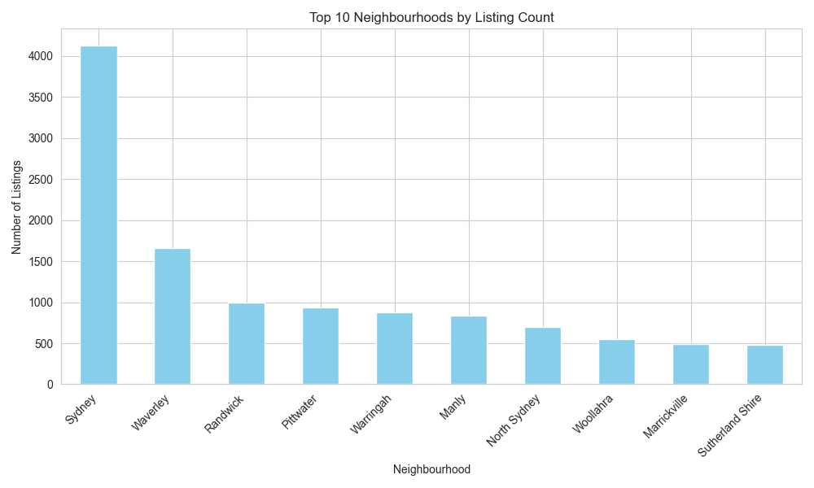
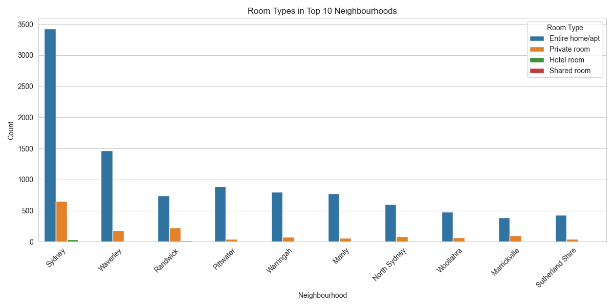
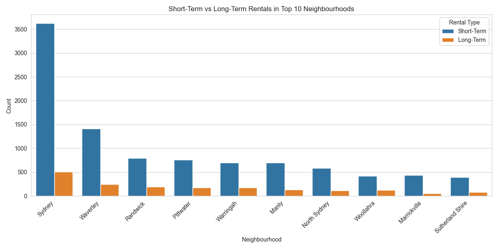
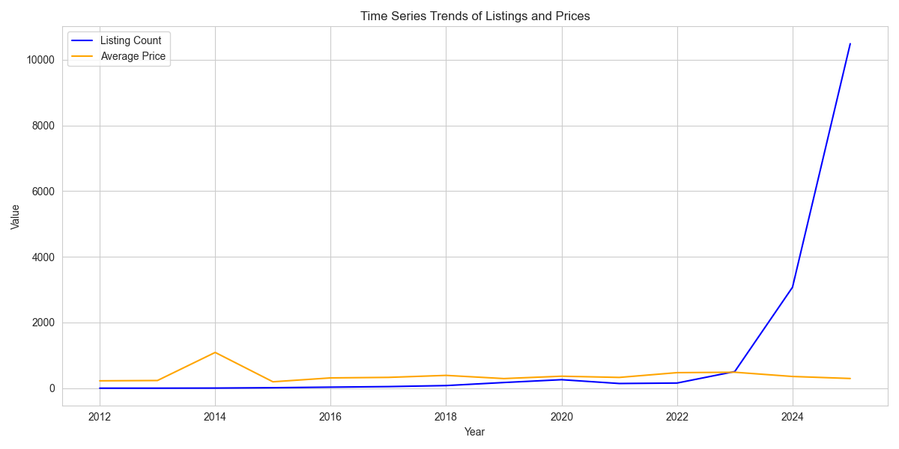
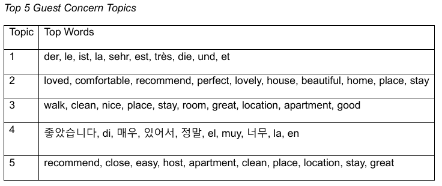

# 📊 Airbnb Market Analysis & Sentiment Modelling

## 📌 Overview

This project presents a **data-driven analysis of Airbnb listings and guest reviews in Sydney** using Python.

It combines **exploratory data analysis (EDA)** with **natural language processing (NLP)** to uncover market trends and customer insights.

**Designed to simulate real-world data analytics applications in urban planning and platform analysis.**

---

## 🧠 Key Features

* Exploratory Data Analysis of Airbnb listings
* Data cleaning and preprocessing of large datasets
* Analysis of top neighbourhoods and property types
* Time series analysis of listing trends and prices
* Natural Language Processing (NLP) using LDA topic modelling
* Identification of key guest concerns from reviews

---

## 📂 Dataset

Data sourced from:
http://insideairbnb.com/get-the-data/

* ~18,000 listings
* ~600,000 reviews

> Note: Datasets are not included in this repository due to size.

---

## 📊 Results

### 🔹 Top Neighbourhoods



### 🔹 Room Types Distribution



### 🔹 Rental Types



### 🔹 Time Series Trends



### 🔹 Guest Review Topics (LDA)



---

## 📈 Key Insights

* Central Sydney dominates listing availability
* Entire homes/apartments are the most common property type
* Short-term rentals are significantly more popular
* Listing prices fluctuate with seasonal demand
* Guest reviews highlight recurring themes such as location, cleanliness, and host quality

---

## ▶️ How to Run

```bash
git clone https://github.com/jessysutherns/airbnb-market-analysis.git
cd airbnb-market-analysis
pip install -r requirements.txt
python src/airbnb_analysis.py
```

---

## 🔧 Technologies Used

* Python
* Pandas
* Matplotlib & Seaborn
* Scikit-learn
* NLTK

---

## 🚧 Future Improvements

* Sentiment classification (positive/negative scoring)
* Interactive dashboards (e.g., Plotly or Power BI)
* Geospatial analysis of listings

---

## 💼 Author

**Jessica Sutherns**
https://github.com/jessysutherns

---

## ⭐ Project Significance

This project demonstrates practical skills in:

* Data analytics
* Big data processing
* Natural language processing

It highlights how data-driven insights can support decision-making in **urban planning, platform regulation, and market analysis**.
